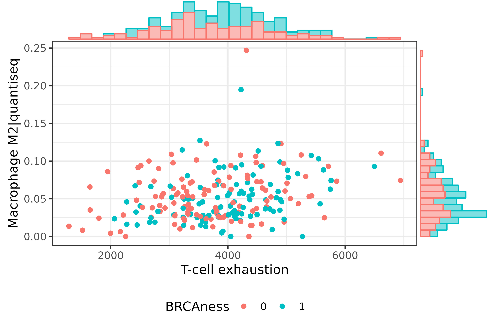
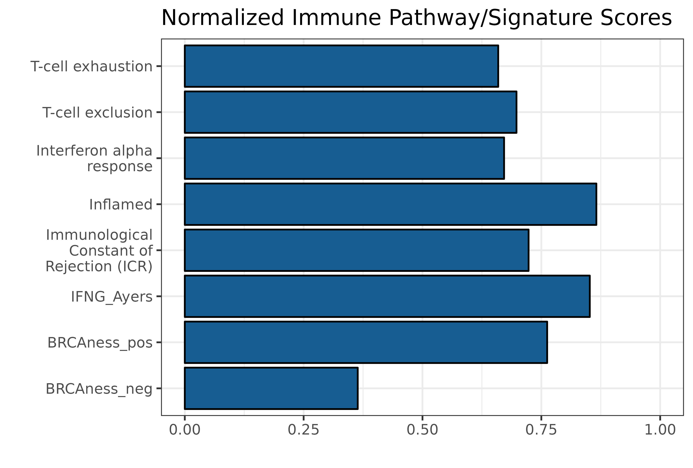

# OvRSeq: An Ovarian Cancer RNA-Seq Analysis Package

[](https://cran.r-project.org/package=ovrseq)
[](https://opensource.org/licenses/MIT)
> :warning: **OvRSeq is still in development**: with great power comes great responsibility!

Cancer immunotherapy has shown limited efficacy in high-grade serous ovarian cancer (HGSOC), prompting clinical trials combining immunotherapy with poly-ADP-ribose polymerase (PARP) inhibitors. Identifying predictive biomarkers is crucial. We introduce a novel diagnostic algorithm and an R package, OvRSeq, for comprehensive RNA sequencing-based characterization of HGSOC samples. Leveraging a 24-gene expression signature, OvRSeq classifies samples for BRCAness, a homologous recombination repair deficiency (HRD) phenotype. It thoroughly profiles the immune environment, including molecular subtype, tumor-immune phenotype, immunophenoscore (IPS), established and novel immune signatures (e.g., IFNg gene set, T cell inflammation, exhaustion, cytolytic activity, immune checkpoints), and estimates infiltrated immune cells via deconvolution methods. OvRSeq also provides an indicator for combination therapy response by assessing BRCAness within an immune environment balanced between activation and suppression.

## Dependencies

OvRseq has dependencies on packages outside CRAN. Please make sure you install them before installing it.


```
# List of packages to be installed
packages <- c("consensusOV", "ensembldb", "org.Hs.eg.db", "IRanges", "biomaRt", 
              "AnnotationDbi", "GSVA", "S4Vectors", "SummarizedExperiment")

# Install BiocManager if it is not already installed
if (!requireNamespace("BiocManager", quietly = TRUE)) {
    install.packages("BiocManager")
}

# Loop through the list of packages and install each one
for (pkg in packages) {
    BiocManager::install(pkg)
}

```

Install packages from github repository.

```
devtools::install_github("omnideconv/immunedeconv")
```

## Installation

You can install the latest version of OvRSeq from GitHub with:

```
# install.packages("devtools")
devtools::install_github("icbi-lab/OvRSeq")
```
Certainly! Below is an example of how you might rewrite the README.md for the OvRSeq package to include descriptions of the implemented functions:


## Features and Functions

Key features provided by OvRSeq include:

- Evaluation of BRCAness status by leveraging a predictive model developed from the TCGA-OV dataset, which helps in identifying the likelihood of BRCAness in ovarian cancer samples.

- Determination of tumor immune phenotypes by assessing the spatial distribution patterns of CD8+ T cells within the tumor microenvironment, aiding in the understanding of immune evasion mechanisms in cancer.

- Molecular subtype classification through a consensus approach that categorizes ovarian cancer into distinct subtypes, enabling tailored therapeutic strategies.

- Immune profile characterization with the calculation of the Immunophenoscore (IPS), which includes assessments of various immune cell types and their activation states.

- Immune deconvolution from gene expression data, which parses out the proportions of different immune cell types, providing insights into the immune landscape of ovarian cancer samples.

- Calculation of enrichment scores for multiple immune-related gene signatures, employing the GSVA method to determine the relative activation of different immune pathways.

- Averaging of expression levels across smaller, defined immune-related gene sets, offering a precise quantification of signature expressions in a given dataset.

OvRSeq effectively serves as a valuable resource for researchers focusing on the molecular and immunological characterization of ovarian cancer, supporting the drive towards precision medicine by furnishing a multi-dimensional analysis of gene expression data.


## Example Usage

Here's how to calculate the average expression for a signature and enrich `colData`:

```r
library(OvRSeq)
#Load TCGA-OV dataset 
load_TCGA_OV()
```

To perform the main analysis :

```r
se <- OvRSeq(TCGA_OV, normalize = F)
```

## Visualization of Analysis Results

### Correlation Plot

To explore the relationship between different immune cell types and their correlation with BRCAness status, we can generate a marginal plot. This plot will display the correlation between the CD8 T cell score (as per Jiang et al.) and Macrophage M2 abundance predicted by quantiseq.

```r
# Generate the plot
p1 <- plot_ggmarginal(se, x_var = "CD8 Jiang", y_var = "Macrophage M2|quantiseq", color_var = "BRCAness")

# Save the plot to the specified directory
plotFile1 <- "./plots/plot1.jpeg"
ggsave(plotFile1, plot = p1, width = 148, height = 148, units = "mm", dpi = 600)
```


### Vulnerability Map

A vulnerability map can be generated to assess the potential response to therapies. It utilizes the BRCAness probability and the cytolytic activity to C1QA ratio (C2C).

```r
# Generate the vulnerability map
p2 <- plot_vulnerabilitymap(se)

# Save the plot to the specified directory
plotFile2 <- "./plots/plot2.jpeg"
ggsave(plotFile2, plot = p2, width = 148, height = 148, units = "mm", dpi = 600)
```


### Immune Signature for a Single Sample

To visualize the immune signature for a specific patient, we can generate a tailored plot for an individual sample identified by `patientID`.

```r
# Generate the immune signature plot
p3 <- plot_immune_signature_one_sample(se, patientID)

# Save the plot to the specified directory
plotFile3 <- "./plots/plot3.jpeg"
ggsave(plotFile3, plot = p3, width = 148, height = 148, units = "mm", dpi = 600)
```


### QUANTISEQ for a Single Sample

Similarly, we can plot the QUANTISEQ results for a single patient to understand the tumor microenvironment composition.

```r
# Generate the QUANTISEQ plot
p4 <- plot_quantiseq_one_sample(se, patientID) + coord_fixed(ratio = 0.1)

# Save the plot to the specified directory
plotFile4 <- "./plots/plot4.jpeg"
ggsave(plotFile4, plot = p4, width = 148, height = 148, units = "mm", dpi = 600)
```


### OvRSeq Report Generation

For comprehensive reporting of the analysis, `OvRSeqReport` function can be used to generate a custom report that encapsulates all the analytical findings and visualizations.

```r
# Generate a custom report for the SummarizedExperiment object 'se'
OvRSeqReport(se, "./OvRSeqReport/")
```


This function will create a [detailed report](./docs/OvRSeqReport.pdf) in the specified directory, which includes all relevant plots, statistical analyses, and interpretations.

For a full list of functions and their descriptions, consult the [package documentation](./docs/OvRSeq.pdf).


## Development and Contributions

OvRSeq is under active development. We welcome contributions and suggestions from the community. Please feel free to submit issues and pull requests through our [GitHub repository](https://github.com/icbi-lab/OvRSeq).

## License

OvRSeq is released under the [MIT License](https://opensource.org/licenses/MIT).


